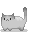

<!-- PROJECT LOGO -->
<br />
<div align="center">
  <a href="https://github.com/brtcrt/lasercats/tree/main">
    
  </a>

<h3 align="center">Laser Cats</h3>


<!-- ABOUT THE PROJECT -->
## About The Project

Laser Cats is a 2D, two-player, tile-based, desktop puzzle game where the players control two cats, one that shoots lasers and one that reflects them. The players will work together to solve levels and progress.


### Prerequisites

JDK Version 11 or higher.


### Installation

1. Clone the repo

   ```sh
   git clone https://github.com/brtcrt/lasercats.git
   ```
   
3. Follow the directions given in [https://libgdx.com/wiki/start/import-and-running] for importing and running a libGDX project. 
